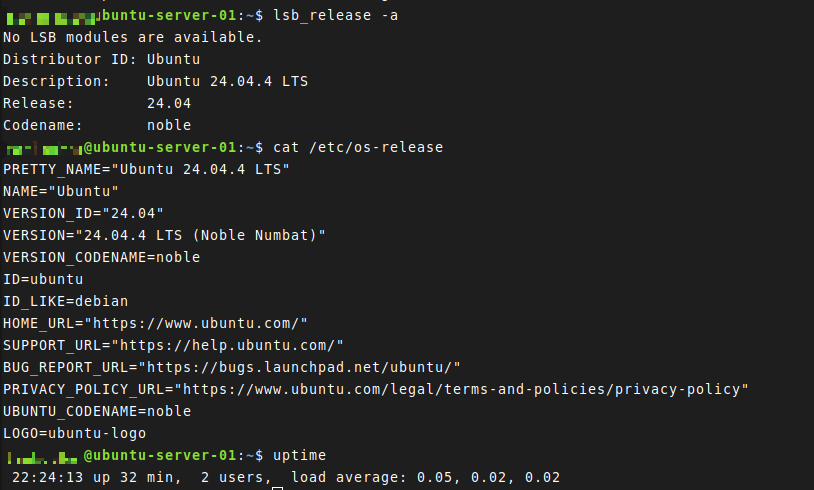

# Day 01 - Get to Know Your Server

## Objective

Become familiar with the Linux server environment, connect remotely using SSH, and review common commands used to inspect system information, hardware, resources, storage, and networking.

---

## Lab Environment

For this challenge, I created a dedicated Linux server virtual machine using Virtual Machine Manager on my home Linux system.

- **Host OS:** Linux
- **Virtualization:** Virtual Machine Manager
- **Guest OS:** Ubuntu 24.04.4 LTS
- **Codename:** Noble Numbat
- **Hostname:** `ubuntu-server-01`
- **Remote Access:** SSH from the host machine

This VM will serve as the dedicated environment for completing the Linux Upskill Challenge.

---

## Topics Covered

- Connecting to a Linux system using SSH
- Identifying the Linux distribution and kernel
- Viewing logged-in users
- Inspecting CPU and hardware information
- Checking memory utilization
- Reviewing storage devices and disk usage
- Viewing network interfaces
- Monitoring system activity

---

## Commands Reviewed

### SSH

```bash
ssh user@server-ip
```

Used to securely connect to a remote Linux system.

---

### Operating System Information

```bash
lsb_release -a
cat /etc/os-release
uname -a
uptime
```

These commands provide information about the operating system, distribution version, kernel, and system uptime.

Example output from the lab system:

```text
Distributor ID: Ubuntu
Description:    Ubuntu 24.04.4 LTS
Release:        24.04
Codename:       noble
```

---

### User Information

```bash
whoami
who
w
```

- `whoami` displays the current user.
- `who` displays users currently logged into the system.
- `w` shows logged-in users and their current activity.

---

### Hardware Information

```bash
lscpu
lsblk
lspci
lsusb
```

These commands provide information about CPU architecture, storage devices, PCI devices, and USB hardware.

---

### Memory and Processes

```bash
free -h
vmstat
top
htop
```

These tools provide information about system memory, CPU activity, running processes, and overall resource utilization.

---

### Storage

```bash
df -h
du -h
```

- `df -h` displays filesystem usage in human-readable units.
- `du -h` displays disk space used by files and directories.

---

### Networking

```bash
ip address
netstat -i
ifstat
```

These commands can be used to view network interfaces, IP addresses, and network activity.

---

## Key Takeaways

Most of the material in Day 01 was already familiar due to prior Linux experience and regular use of Linux as my primary operating system.

The main value of this lesson was reinforcement and command recall.

Commands such as:

```bash
lsb_release -a
lsblk
lspci
htop
free -h
```

are useful tools that I understand but may not use frequently enough to immediately recall without review.

Revisiting them helped reinforce several methods for quickly gathering system information from the command line.

---

## Personal Notes

Day 01 was completed without any major issues or troubleshooting.

Because Linux is already my daily-driver operating system, this lesson served primarily as a refresher rather than an introduction.

I created the challenge environment using Virtual Machine Manager and installed Ubuntu Server 24.04.4 LTS as the guest operating system.

I then connected to the server remotely using SSH from my host Linux system.

Everything worked as expected. The primary benefit of the lesson was refreshing my memory on commands that I understand but may not use regularly during day-to-day work.

---

## Screenshots

### System Information



The screenshot above shows system information gathered from the Ubuntu server during Day 01.

---

## Status

✅ Day 01 Completed
