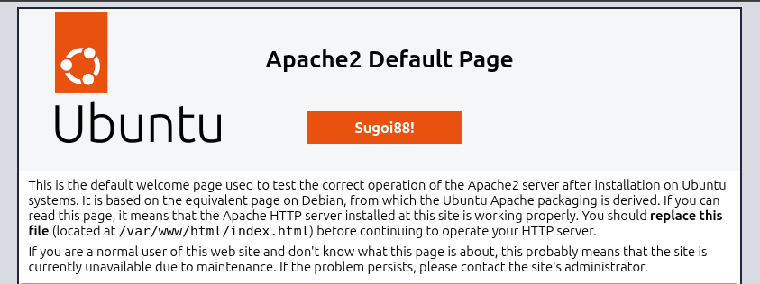

# Day 07 - The Server and Its Services

## Objective

Install and manage the Apache2 web server while becoming more familiar with how Linux services operate.

This lesson focused less on web development itself and more on understanding how server applications are installed, configured, started, stopped, monitored, and logged.

---

## Topics Covered

- Installing Apache2
- Understanding Linux services and daemons
- Managing services with `systemctl`
- Checking service status
- Locating Apache configuration files
- Understanding the Apache document root
- Editing the default web page
- Reviewing Apache access and error logs
- Understanding how running services increase system attack surface

---

## Installing Apache2

Before installing new software, refresh the available package information:

```bash
sudo apt update
```

Install Apache2:

```bash
sudo apt install apache2
```

Apache is installed as a system service and will normally begin running automatically after installation.

---

## Verifying Apache

The status of the Apache service can be checked with:

```bash
systemctl status apache2
```

A successfully running server should report the service as:

```text
active (running)
```

The web server can then be tested by browsing to the IP address of the Linux server.

For example:

```text
http://SERVER-IP
```

If Apache is working correctly, the default Apache2 Ubuntu page should appear.

---

## Managing Services with `systemctl`

Linux services managed by `systemd` can be controlled using `systemctl`.

### Stop Apache

```bash
sudo systemctl stop apache2
```

After stopping the service, the web page should no longer be available.

### Start Apache

```bash
sudo systemctl start apache2
```

### Restart Apache

```bash
sudo systemctl restart apache2
```

### Check Status

```bash
systemctl status apache2
```

These commands form part of a common workflow when administering Linux services.

---

## Services and Daemons

Apache runs as a background service.

Unlike a normal interactive program, the Apache service does not require a user to remain logged into the server.

It continues running in the background and responds to incoming HTTP requests.

Linux servers commonly run many similar background services, including:

```text
sshd
apache2
cron
systemd-journald
```

The exact services present depend on the purpose and configuration of the system.

---

## Apache Configuration

Apache configuration files are primarily stored under:

```text
/etc/apache2/
```

The main configuration file is:

```text
/etc/apache2/apache2.conf
```

It can be viewed using:

```bash
less /etc/apache2/apache2.conf
```

or edited when necessary using an editor such as:

```bash
sudo vim /etc/apache2/apache2.conf
```

Apache divides much of its configuration across multiple files rather than storing everything inside a single configuration file.

This makes individual features and site configurations easier to manage independently.

---

## Apache Configuration Structure

Several important Apache directories include:

```text
/etc/apache2/
├── apache2.conf
├── conf-available/
├── conf-enabled/
├── mods-available/
├── mods-enabled/
├── sites-available/
└── sites-enabled/
```

The `available` directories generally contain configurations that exist on the system.

The `enabled` directories represent configurations that are currently active.

This modular approach makes it possible to enable or disable sites, modules, and configuration components without maintaining one enormous configuration file.

---

## Default Virtual Host

The default Apache site configuration can be found at:

```text
/etc/apache2/sites-enabled/000-default.conf
```

One important directive inside this configuration is:

```text
DocumentRoot /var/www/html
```

The `DocumentRoot` tells Apache where to find the files that should be served to visitors.

---

## Apache Document Root

The default Apache web content is stored under:

```text
/var/www/html/
```

The default page is normally:

```text
/var/www/html/index.html
```

It can be viewed with:

```bash
less /var/www/html/index.html
```

or edited with:

```bash
sudo vim /var/www/html/index.html
```

When the page is changed and saved, refreshing the browser displays the updated content.

---

## Testing Web Content

Even simple text can be served by Apache.

For example:

```html
<h1>Linux Upskill Challenge</h1>
<p>Apache is working successfully.</p>
```

This makes editing the default page a simple way to confirm that:

1. Apache is running.
2. The correct document root has been identified.
3. The user can modify web content.
4. Apache is successfully serving the updated file.

---

## Apache Logs

Apache logs are stored under:

```text
/var/log/apache2/
```

Two particularly important files are:

```text
access.log
error.log
```

---

## Access Log

The access log records requests received by the web server.

View it with:

```bash
less /var/log/apache2/access.log
```

or:

```bash
sudo tail /var/log/apache2/access.log
```

Opening the Apache page in a browser should generate entries in this log.

The access log can contain information such as:

- Client IP address
- Requested resource
- HTTP method
- HTTP response code
- Browser or user-agent information
- Request timestamp

These logs are valuable for both troubleshooting and security analysis.

---

## Error Log

Apache errors are generally written to:

```text
/var/log/apache2/error.log
```

View recent entries with:

```bash
sudo tail /var/log/apache2/error.log
```

The error log can help diagnose problems involving:

- Apache configuration
- Permissions
- Missing files
- Modules
- Application failures

---

## Service Logs with `journalctl`

Because Apache is managed by `systemd`, information about the service can also be retrieved through the system journal.

For example:

```bash
journalctl -u apache2
```

Recent entries can be viewed with:

```bash
journalctl -u apache2 -n 20
```

This provides another useful source of information when troubleshooting a service.

---

## Security Considerations

Installing a network-accessible service changes the security profile of a server.

Previously, the challenge server primarily exposed SSH for remote administration.

After installing Apache, the system also begins listening for HTTP traffic.

Common ports now include:

```text
22/tcp  - SSH
80/tcp  - HTTP
```

Every additional network-accessible service increases the system's attack surface.

This makes several practices important:

```bash
sudo apt update
sudo apt upgrade
```

along with:

- Installing security updates
- Running only necessary services
- Reviewing service configuration
- Monitoring logs
- Restricting network access where appropriate
- Keeping installed software maintained

Installing a service is therefore not just a functionality decision but also a security decision.

---

## Useful Commands

```bash
sudo apt update
sudo apt install apache2

systemctl status apache2
sudo systemctl start apache2
sudo systemctl stop apache2
sudo systemctl restart apache2

less /etc/apache2/apache2.conf
less /etc/apache2/sites-enabled/000-default.conf

sudo vim /var/www/html/index.html

less /var/log/apache2/access.log
less /var/log/apache2/error.log

journalctl -u apache2
```

---

## Key Takeaways

Day 07 connected several Linux concepts from earlier lessons into a practical server administration workflow.

Installing Apache demonstrated how package management, configuration files, services, permissions, networking, logs, and text editing work together when administering an actual server application.

The general workflow can be applied far beyond Apache:

```text
Install
   ↓
Configure
   ↓
Start / Restart
   ↓
Check Status
   ↓
Test
   ↓
Review Logs
   ↓
Troubleshoot
```

This same pattern appears repeatedly when working with Linux services.

Another important takeaway is that successfully starting a service is only part of administration.

It is also necessary to understand:

- Where its configuration lives
- Where its data lives
- Where its logs are stored
- Which network ports it exposes
- How to restart or stop it
- How the service affects system security

---

## Personal Notes

Day 07 was straightforward and completed without any major issues.

As a small additional exercise, I edited the default Apache HTML page located at:

```text
/var/www/html/index.html
```

I added a small **"Sugoi88!"** message to the default Apache2 page as a visual confirmation that I had successfully:

- Installed Apache
- Started the web service
- Located the correct document root
- Edited the site's HTML
- Served the modified page successfully through Apache

It was only a small change, but it provided an immediate visual confirmation that the web server and modified content were working correctly.

---

## Screenshots

### Apache2 Successfully Running



The Apache2 default page successfully loaded from the Ubuntu Server VM after modifying the site's `index.html` file.

The custom **"Sugoi88!"** message confirms that the edited content was being served successfully by Apache.

---

## Status

✅ Day 07 Completed
